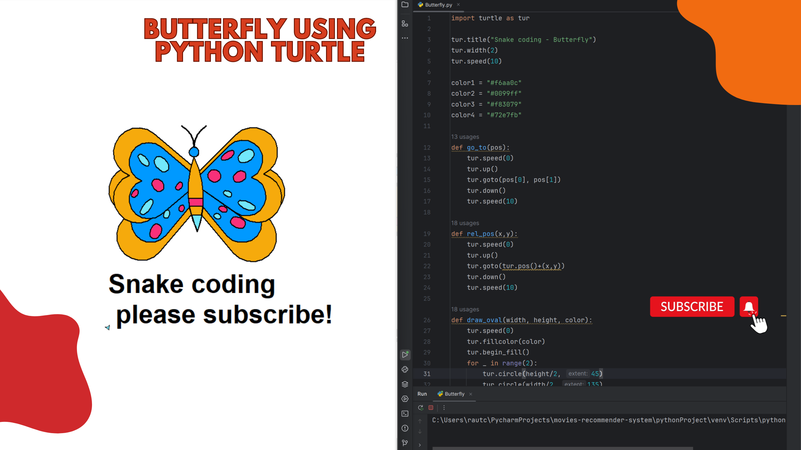

# Beautiful Butterfly Using Python Turtle
This repository contains a Python script that uses the Turtle graphics module to draw a beautiful butterfly.

# Description

This project uses Python's built-in Turtle module to create a stunning butterfly design. The script uses a combination of loops, functions, and Turtle's drawing functions to create the intricate patterns and colors of the butterfly's wings.

# Screenshots

Beautiful Butterfly

# Tutorial is available on youtube channel 
click on the link to see :- ([Open in Youtube](https://youtu.be/08rlPhbpavU))

# Features

Generates a beautiful butterfly design using Turtle graphics
Customizable wing shape, size, and color
Easy to modify and extend
Demonstrates advanced Turtle graphics techniques
Usage

To use this project, simply clone the repository and run the butterfly.py script using Python. You can customize the wing shape, size, and color by modifying the script.

# Requirements

Python 3.x
Turtle module (built-in with Python)
(pip install turtle)

# Author

Snake Coding

# License

This project is licensed under the MIT License.

# How to Run

Clone the repository: git clone https://github.com/SnakeCodinx/Beautiful-Butterfly-Using-Python-Turtle.git
Navigate to the project directory: cd Beautiful-Butterfly-Using-Python-Turtle
Run the script: py butterfly.py

# Customization

You can customize the wing shape, size, and color by modifying the script. For example, you can change the wing_size variable to change the size of the wings, or modify the wing_color variable to change the color of the wings.

# Techniques Used

Loops (for, while) to create repetitive patterns
Functions to organize and reuse code
Turtle graphics functions (forward, backward, left, right, penup, pendown) to draw the butterfly's wings
Color manipulation to create a gradient effect

# Contributing

Contributions are welcome! If you'd like to add new features or improve the script, please submit a pull request.

# Issues

If you encounter any issues or have questions, please open an issue in this repository.

# snakecoding_12

We create a project each 4 days with voting on our <a href="https://youtube.com/@snakecoding_12" target="_blank">Youtube</a> channel.
You can vote for upcoming projects on our channel **community** page :wink:
